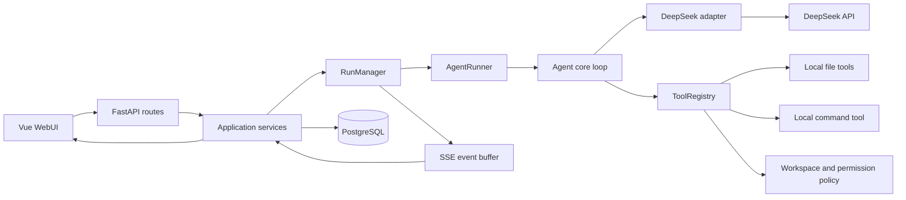
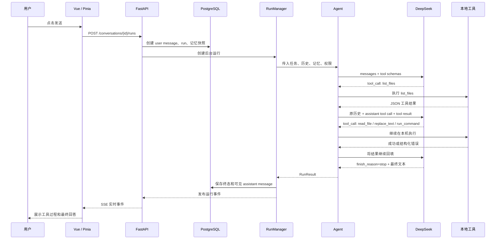
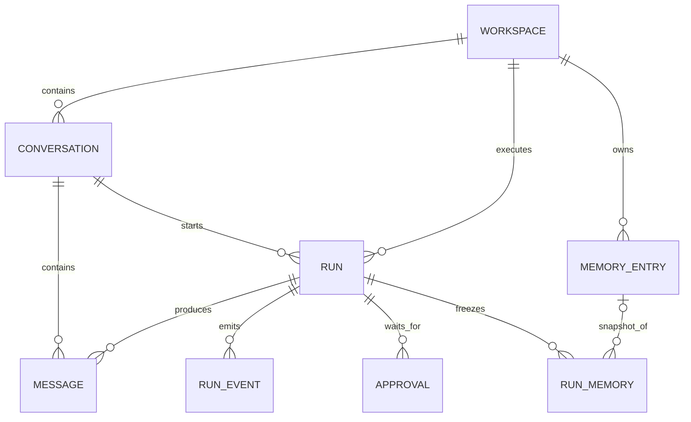

# Coding Agent 项目知识学习指南

> 适合读者：第一次接触 LLM Agent、但具备基础 Python / Web 编程知识的同学。  
> 阅读目标：不只会启动项目，还能解释它为什么这样运转、每一层负责什么、一次任务如何从网页进入模型并最终修改本地代码。

---

## 1. 先用一句话理解这个项目

Coding Agent 是一个由本项目自己控制循环的本地编程智能体：

1. 把用户任务、会话历史和工作区记忆发给 DeepSeek；
2. 模型决定是回答用户，还是调用某个工具；
3. 项目在本机执行模型选择的工具；
4. 把工具结果重新发给模型；
5. 重复上述过程，直到模型给出最终回答，或者运行触发预算、错误、取消等终止条件。

最重要的一点是：**DeepSeek 不是这个 Agent 的全部，模型只负责做每一轮决策；让它真正成为 Agent 的循环、工具、上下文、错误处理和终止控制，都是本项目代码实现的。**

可以先记住下面这个公式：

```text
编程智能体 = 大语言模型 + 上下文 + 本地工具 + 控制循环 + 终止条件
```

如果只有一次普通的模型问答，没有“模型选工具 → 本地执行 → 结果回填 → 再决策”的循环，它就只是聊天程序，不是本题要求的编程智能体。

---

## 2. PDF 题目到底要求什么

题目要求独立设计并实现一个简化版 Claude Code / Codex。它必须能够通过模型交互，自主读写文件、执行命令并完成编程任务。

题目明确允许：

- 使用模型厂商 API 客户端；
- 使用 OpenAI 兼容接口；
- 使用模型原生 function/tool calling。

题目明确不允许：

- 在现成 Agent 产品外面套一层界面；
- 使用 LangChain、LlamaIndex、OpenAI Agents SDK、AutoGen、CrewAI 等 Agent 框架；
- 使用 API 服务端托管的代码执行或文件工具。

题目要求自己完成的重要逻辑包括：

- 对话历史与上下文管理；
- 工具定义和本地执行；
- 模型输出解析；
- Agent 循环和终止条件；
- 错误处理。

当前项目与要求的对应关系如下：

| PDF 核心要求 | 当前实现位置 |
|---|---|
| 对话历史与上下文 | `backend/src/coding_agent/agents/context.py` |
| Agent 控制循环 | `backend/src/coding_agent/agents/agent.py` |
| 模型输出规范化 | `backend/src/coding_agent/agents/providers/deepseek.py` |
| 工具 JSON Schema | `backend/src/coding_agent/agents/tools/schemas.py` |
| 本地工具执行 | `backend/src/coding_agent/agents/tools/` |
| 文件和工作区边界 | `backend/src/coding_agent/agents/security/workspace.py` |
| 命令执行与分类 | `backend/src/coding_agent/agents/tools/command.py`、`agents/security/command_policy.py` |
| 循环终止与预算 | `agents/agent.py`、`agents/contracts.py` |
| 错误处理 | 核心循环、Provider、工具层各自处理本层错误 |
| 真实任务验收 | `backend/examples/date_boundary_bug/`、`backend/evaluation/` |

FastAPI、Vue、PostgreSQL、工作区选择、长期记忆和三档权限不是题目规定必须做的核心，但它们让核心 Agent 更容易被真实使用和展示。它们不能代替 Agent 循环，也没有代替它。

---

## 3. 从整体看项目架构

仓库主要分为两个业务目录：

```text
agent_project/
├─ backend/                  Python 后端和 Agent 核心
├─ frontend/                 Vue WebUI
├─ README.md                 运行说明
└─ PROJECT_GUIDE_CN.md       本学习指南
```

后端内部采用“核心在内、界面和数据库在外”的分层方式：



这个结构的核心思想是：

- `core` 不依赖 FastAPI、Vue、PostgreSQL；
- `providers` 不负责决定何时停止，也不执行工具；
- `tools` 不调用模型；
- `application` 只负责编排持久化状态与运行线程；
- WebUI 只展示状态和收集用户操作，不决定后端权限。

因此 CLI 和 Web 可以复用同一个 Agent 核心。Web 不是在另一个 Agent 产品上套壳。

---

## 4. 后端目录逐层认识

### 4.1 `core/`：整个项目最重要的部分

```text
core/
├─ agent.py           Agent 状态机和主循环
├─ contracts.py       模型、工具、结果、预算等公共契约
├─ context.py         可见历史和工作区记忆的上下文构建
└─ tool_protocol.py   严格解析工具参数、规范化工具结果
```

如果面试只允许讲一个目录，就讲这里。

### 4.2 `providers/`：把 DeepSeek 接到统一接口上

```text
providers/
└─ deepseek.py
```

它使用官方 `openai` Python 包连接 DeepSeek 的 OpenAI-compatible Chat Completions API。SDK 只负责 HTTP 请求和响应对象，不负责 Agent 循环。

### 4.3 `tools/`：模型能够使用的本地能力

```text
tools/
├─ schemas.py         发给模型的六个工具说明
├─ registry.py        参数校验、审批与工具分发
├─ filesystem.py      列目录、读文件、创建文件、替换文本
├─ command.py         运行本地命令
└─ contracts.py       工具参数和错误类型
```

### 4.4 `security/`：工具执行时的工作区和权限规则

```text
security/
├─ workspace.py           工作区内路径解析与文件边界
├─ workspace_policy.py    Web 可选择的允许根目录
├─ command_policy.py      ALLOW / CONFIRM / DENY 分类
├─ permission_policy.py   三档运行权限
└─ approval.py            统一审批请求对象
```

这些规则是应用层约束，不是 Windows 内核级沙箱。后文会详细解释这个边界。

### 4.5 `runs/`：Web 模式下的一次后台运行

```text
runs/
├─ agent_runner.py       为一次运行装配模型、工具和 Agent
├─ run_manager.py        管理线程、取消、工作区互斥和运行状态
├─ approval_broker.py    阻塞等待用户批准或拒绝
└─ event_buffer.py       实时运行事件缓冲
```

### 4.6 `application/`：Web 用例编排

这里把数据库中的 workspace、conversation、run、memory 与进程内 `RunManager` 连接起来。它不实现模型决策。

### 4.7 `persistence/`：PostgreSQL 持久化

使用 SQLAlchemy 2 定义模型，Alembic 执行数据库迁移，psycopg 连接 PostgreSQL。

### 4.8 `api/`：FastAPI HTTP/SSE 边界

只包含路由、请求/响应 Schema、依赖注入和错误映射。理想情况下，业务逻辑不应堆在路由函数里。

### 4.9 其他目录

- `diagnostics/`：保存白名单诊断事件，不记录隐藏推理和完整文件内容；
- `examples/date_boundary_bug/`：正式演示使用的日期边界缺陷项目；
- `evaluation/`：Agent 看不到的独立验收程序；
- `tests/`：核心、工具、Provider、持久化、API、前端协作等测试；
- `alembic/`：数据库版本迁移；
- `deploy/compose.yml`：独立 PostgreSQL 容器。

---

## 5. 一次任务从网页到最终回答的完整调用链

假设用户在网页中发送：

> 修复日期边界问题，补充回归测试并运行测试。

完整过程如下：



按代码再细分：

1. `frontend/src/features/runs/runStore.ts` 创建 `client_request_id`，乐观显示用户消息并调用运行 API；
2. `router/runs.py` 接收请求并调用 `ConversationRunService.create()`；
3. 持久化层在同一事务内创建 run、用户消息，并冻结本次实际使用的记忆；
4. `ConversationRunService` 将数据库记录转换为 `RunSpec`；
5. `RunManager` 创建后台工作线程；
6. `AgentRunner` 为这一次运行新建 `DeepSeekAdapter`、`ToolRegistry` 和 `AgentConfig`；
7. `Agent.run()` 进入循环；
8. 运行事件通过 `EventBuffer` 和 PostgreSQL 事件表送到 SSE；
9. 前端收到 `run.finished` 后重新读取 run 和会话消息，显示最终结果。

---

## 6. Agent 主循环：项目真正的核心

主循环在 `backend/src/coding_agent/agents/agent.py`。为了理解它，可以先看简化伪代码：

```python
history = [system_message, prior_history, current_task]

while True:
    检查取消、时间、模型调用次数、token 预算

    completion = model.complete(history, tool_schemas)

    if completion 表示最终回答:
        把 assistant 消息加入 history
        return 最终结果

    if completion 表示工具调用:
        把 assistant 的 tool_calls 加入 history

        for 每个 tool_call:
            严格解析 JSON 参数
            本地执行工具
            把 tool result 加入 history

        continue  # 携带新历史，再问模型
```

实际实现比伪代码多出的部分，主要是题目要求的协议和错误处理：

### 6.1 每轮开始前检查预算

默认限制在 `AgentConfig` 中：

- 最多 16 次模型请求；
- 最多 40 次工具调用；
- 累计最多 200000 token；
- 总墙钟时间 480 秒；
- 单次 API 超时 60 秒；
- 瞬时 API 错误最多重试 3 次。

这些预算确保模型即使陷入重复尝试，运行也一定会停下来。

### 6.2 模型返回 `stop`

这表示模型不再请求工具，而是给出最终文本。核心会检查：

- 不能同时又携带 tool calls；
- `content` 必须是非空字符串；
- 符合协议后才以 `model_final` 终止。

注意：`model_final` 只表示“模型认为自己完成了”，不等于程序真的正确。真实正确性需要测试或独立 verifier 判断。

### 6.3 模型返回 `tool_calls`

核心会：

1. 检查本轮确实包含工具调用；
2. 检查每个 tool call ID 唯一，并且整次运行中没有复用；
3. 确认本批工具数量没有超过预算；
4. 先把 assistant tool-call 消息写入历史；
5. 顺序执行每一个工具；
6. 无论成功还是失败，都为每个调用补上一条对应的 tool 消息。

为什么同一轮多个工具采用顺序执行？因为并发写同一个工作区会让修改顺序不确定。当前项目优先保证行为可解释。

### 6.4 工具失败为什么不立即结束 Agent

工具失败会被转成结构化 JSON，例如：

```json
{
  "ok": false,
  "error": {
    "code": "command_exit_nonzero",
    "message": "The command exited with a non-zero status.",
    "retryable": false
  }
}
```

这条结果会回填给模型。模型可以根据错误重新读文件、修代码或换一个命令。因此日志中看到多个 `run_command 失败` 不一定代表 Agent 整体失败，它可能是在运行测试、读懂报错、修改代码、再次测试。

### 6.5 为什么必须完整保留消息配对

标准 tool calling 历史类似：

```text
user: 修复这个 bug
assistant: tool_call(id=call_1, name=read_file, arguments=...)
tool: tool_call_id=call_1, content={...文件内容...}
assistant: tool_call(id=call_2, name=replace_text, arguments=...)
tool: tool_call_id=call_2, content={...修改成功...}
assistant: 已修复并通过测试
```

assistant 发出的每个 tool call 都必须有同 ID 的 tool result。少一条、ID 对不上或历史顺序错误，下一次模型请求就可能被 API 拒绝。

---

## 7. DeepSeek 适配器到底做什么

`agents/providers/deepseek.py` 的职责很窄：

1. 使用官方客户端发送非流式 Chat Completions 请求；
2. 设置 `deepseek-v4-flash`、thinking high、tools、超时和最大输出 token；
3. 把供应商响应转换成项目自己的 `ModelCompletion`；
4. 把网络错误、超时和 HTTP 状态映射成稳定的 `AdapterRequestError`；
5. 不让原始响应正文进入公开错误信息。

它明确不负责：

- 保存历史；
- 解析工具参数 JSON；
- 执行工具；
- 选择何时终止 Agent；
- 判断任务是否真正正确。

### 7.1 为什么要定义 Provider 无关的契约

核心依赖的是 `CompletionAdapter` 协议，而不是直接依赖 OpenAI SDK 类型。这样测试时可以传入假模型：

```python
class FakeAdapter:
    def complete(self, messages, tools, timeout_seconds=None):
        return 预先构造的_ModelCompletion
```

这允许在没有 API key、没有网络、没有费用的情况下，完整测试“读文件 → 修改 → 测试 → 最终回答”的循环。

### 7.2 `reasoning_content` 为什么特殊

DeepSeek V4 thinking + tools 要求后续请求回放之前 assistant tool turn 的 `reasoning_content`。因此项目在本次运行的内存历史中保留它，保证协议连续。

但是隐藏推理不会：

- 显示在网页；
- 写入 PostgreSQL message 表；
- 写入普通运行日志。

这就是“运行协议需要保留”和“长期持久化不应保存”之间的区别。

---

## 8. 六个本地工具

模型收到的是 JSON Schema，不是 Python 函数本身。模型只能输出“我想调用哪个工具和什么参数”，真正执行发生在本机。

### 8.1 `list_files`

用途：递归查看工作区目录结构。

典型参数：

```json
{"path":".","glob":"*.py","max_entries":200}
```

特点：

- 输出按稳定顺序排列；
- 最多返回 500 项；
- 有实际扫描量上限；
- 目录链接只列出，不继续遍历；
- 跳过受保护或生成目录。

### 8.2 `read_file`

用途：读取 UTF-8 文本，可以指定从第几行到第几行。

```json
{"path":"src/service.py","start_line":1,"end_line":200}
```

返回内容除了文本，还包括 SHA-256、换行风格、BOM、是否截断等元数据。SHA-256 会用于后续安全修改。

### 8.3 `search_text`

用途：在工作区 UTF-8 文件中搜索单行字面文本，先定位符号或引用，再精确读取相关文件。

```json
{
  "query": "parse_date",
  "path": "src",
  "glob": "*.py",
  "case_sensitive": true,
  "max_results": 100,
  "context_lines": 1
}
```

它由 Python 直接扫描文件，不调用 shell 或外部 `rg`。扫描文件数、总字节数、单文件大小、结果数量
和输出字符数都有独立上限；结果稳定排序，不进入链接、生成目录和受保护目录。它是只读工具，在三档
权限下都自动执行。

### 8.4 `write_file`

用途：原子创建一个新 UTF-8 文件。

```json
{"path":"tests/test_boundary.py","content":"..."}
```

它不会覆盖已有文件。编辑已有文件必须使用 `replace_text`。这个区分能减少模型误把整份旧文件覆盖掉的风险。

### 8.5 `replace_text`

用途：在已有文件中把唯一一段旧文本替换为新文本。

```json
{
  "path": "src/service.py",
  "old_text": "旧代码",
  "new_text": "新代码",
  "expected_sha256": "read_file 返回的 64 位哈希"
}
```

它要求：

- `old_text` 恰好匹配一次；
- 文件当前 SHA-256 与最近读取时相同；
- 如果文件已被别的步骤改变，返回 `stale_file`，模型必须重新读取。

这是一种乐观锁：先读到版本 A，修改时仍必须确认文件还是版本 A。

### 8.6 `run_command`

用途：运行测试、类型检查、编译检查等本地命令。

```json
{
  "argv": ["python", "-m", "pytest", "-q"],
  "cwd": ".",
  "timeout_seconds": 120
}
```

关键设计：

- 使用 argv 数组，而不是一整段 shell 字符串；
- `shell=False`；
- 不支持管道、重定向、`&&`、批处理文件和 shell host；
- stdout/stderr 有长度限制；
- 子进程环境会移除 API key、数据库密码等敏感变量；
- 命令时限不能超过 Agent 剩余总时限。

### 8.7 常见 `run_command` 失败怎么理解

| 错误码 | 含义 | 模型下一步通常应该做什么 |
|---|---|---|
| `command_exit_nonzero` | 命令成功启动，但退出码不是 0 | 阅读 stderr，修复代码或测试后重跑 |
| `tool_io_error` | 进程创建、文件句柄或系统 IO 出错 | 检查可执行文件、cwd、环境或参数 |
| `command_timeout` | 超过命令时限 | 缩小测试范围或修复卡死逻辑 |
| `command_denied` | 命令命中不可变 DENY 规则 | 换成允许的单一可执行程序；不能靠权限模式绕过 |
| `tool_rejected` | 用户拒绝了这次审批 | 尊重拒绝，选择无副作用的替代步骤或停止 |
| `executable_not_found` | PATH 中找不到可执行文件 | 检查环境和命令名 |

“测试失败”通常表现为 `command_exit_nonzero`，这在修 bug 的中间阶段是正常反馈，不是系统异常。

### 8.8 完全重复工具交换提示

核心会为“工具名 + 规范化参数 + 去除耗时字段后的结果”计算 SHA-256 指纹。如果同一指纹在一次运行中
第三次出现，项目会保留原工具结果的 `ok`、数据和错误码，并在 `meta.progress_warning` 中提示模型先
分析结果、改变策略。检测器最多保存 128 个哈希，不保存原始参数或输出。

这不是通用的“任务无进展判定”，也不会提前终止运行。修改后重跑相同测试、相同命令得到新输出等
情况不会被视为完全相同的交换；最终终止仍由模型、取消和硬预算决定。

---

## 9. 三档权限如何真正生效

三档权限不是前端装饰，而是在创建 run 时写入数据库，并传到后端 `ToolRegistry`。

| 模式 | 读取 | 修改文件 | 常规检查命令 | 风险命令 | DENY 命令 |
|---|---:|---:|---:|---:|---:|
| `ask` 请求批准 | 自动 | 每次询问 | 每次询问 | 每次询问 | 禁止 |
| `agent` 帮我批准 | 自动 | 自动 | 自动 | 询问 | 禁止 |
| `workspace_full` 工作区完全访问 | 自动 | 自动 | 自动 | 自动 | 禁止 |

权限合并过程是：

```text
命令本身的分类 ALLOW / CONFIRM / DENY
                +
本次 run 冻结的 ask / agent / workspace_full
                ↓
最终是执行、请求审批，还是拒绝
```

几个必须掌握的边界：

1. 权限在 run 创建时冻结，运行中改变前端下拉框不会影响已经开始的任务；
2. 三种模式都不能访问工作区外的文件工具路径；
3. `workspace_full` 也不能绕过 `DENY`；
4. 当前实现中 Git push、commit、reset、clean 等远端或历史修改操作属于 DENY；
5. 权限系统是应用规则，不是操作系统沙箱。

### 9.1 审批链路

当工具需要批准时：

1. `ToolRegistry` 或 `run_command` 生成 `ToolApprovalRequest`；
2. `ApprovalBroker.confirm()` 发布 `approval.required`；
3. 当前工作线程等待；
4. 前端通过 SSE 看到审批卡片；
5. 用户调用 approval API 批准或拒绝；
6. `ApprovalBroker.resolve()` 唤醒工作线程；
7. 批准则继续执行，拒绝则把结构化工具错误回填给模型。

---

## 10. 工作区是什么，为什么先选工作区

工作区是 Agent 本次允许读写的本地目录根。例如：

```text
E:\code\some-project
```

`CODING_AGENT_ALLOWED_ROOT` 是网页允许浏览和登记工作区的更大范围，例如：

```text
E:\code
└─ some-project       可以登记为工作区
```

网页不能随意读取浏览器所在电脑的所有目录。它只能让后端浏览允许根目录之下的文件夹，并把选中的规范路径登记到 PostgreSQL。

工具调用中使用相对工作区路径，而不是任意绝对路径：

```text
工作区：E:\code\some-project
工具 path：src\app.py
最终目标：E:\code\some-project\src\app.py
```

路径解析还会处理 `..`、符号链接、junction/reparse point、受保护文件等情况，避免普通文件工具轻易逃出工作区。

但需要诚实区分：文件工具的路径被限制，不代表获准运行的任意 Python 程序也被 Windows 内核限制。真正的强隔离需要容器、虚拟机或受限操作系统账户，当前项目没有宣称实现这一点。

---

## 11. 会话历史和长期记忆不是一回事

### 11.1 会话历史

同一个 conversation 中以前的可见 user / assistant 消息，会在下一次运行开始前读取并构造成 `AgentContext`。

只保存和回放可见消息：

- `user`；
- `assistant`。

不会把过去运行的完整工具输出、隐藏推理、原始 Provider 响应存进会话。

上下文构建器从最近消息向前保留，受以下限制：

- 最多 48 条历史消息；
- 历史正文合计最多 80000 字符；
- 单条历史消息最多 24000 字符。

历史被包装成一条普通 user 数据消息，防止它与 system 指令混淆。

### 11.2 工作区长期记忆

记忆属于 workspace，不属于某个 conversation。同一工作区中的不同会话可以共享它。

记忆类型：

- `preference`：用户偏好；
- `fact`：项目事实；
- `decision`：已确定的设计决定；
- `note`：普通备注。

当前设计采用手动确认写入：模型没有“保存记忆”工具。用户在 UI 中新增、编辑、启用、置顶或删除记忆。

### 11.3 为什么要冻结记忆快照

创建 run 的数据库事务会把本次实际使用的记忆复制到 `run_memories`：

- 最多 32 条；
- 记忆正文合计最多 32000 字符；
- 单条进入 Agent 上下文最多 4000 字符；数据库当前单条内容限制为 2000 字符。

运行开始后，即使原记忆被修改，这次 run 仍使用创建时的快照。这样以后能回答：“这次模型当时到底看到了哪些记忆？”

同一工作区有活动 run 时，记忆修改会被拒绝，避免运行期间改变输入集合。

### 11.4 当前没有做什么

- 没有 embedding；
- 没有 pgvector 相似度检索；
- 没有跨工作区用户画像；
- 没有模型自动写长期记忆；
- 不会根据任务动态让另一个模型生成摘要。

Docker 镜像包含 pgvector，不代表当前版本已经使用向量检索。

---

## 12. PostgreSQL 保存了哪些东西

主要实体关系可以简化为：



各表的作用：

| 表 | 作用 |
|---|---|
| `workspaces` | 工作区规范路径和显示名称 |
| `conversations` | 工作区内的会话、默认权限、是否使用记忆 |
| `messages` | 用户可见的 user / assistant 消息 |
| `runs` | 一次 Agent 运行的状态、权限、模型、token、次数和错误 |
| `run_events` | 可供 SSE 断线续传的安全事件 |
| `approvals` | 一次性审批状态 |
| `memory_entries` | 当前工作区记忆 |
| `run_memories` | 某次 run 实际使用的不可变记忆副本 |

重要数据库约束：

- `(conversation_id, client_request_id)` 唯一，防止浏览器重试重复创建任务；
- 同一 workspace 同时最多一个活动 run；
- 同一 run 最多一个 pending approval；
- 同一 conversation 的 message 序号唯一；
- 同一 workspace 的相同记忆内容按哈希去重。

数据库刻意不保存：

- `reasoning_content`；
- 原始 DeepSeek 响应；
- 完整工具输出；
- 环境变量；
- API key。

---

## 13. RunManager、线程和 SSE

### 13.1 为什么 Web 请求不能直接跑完整 Agent

一次 Agent 可能运行几十秒，还可能等待人工审批。如果 HTTP 请求一直同步等待，页面体验和取消控制都会很差。

因此创建 run API 返回 `202 Accepted`，真正执行交给 `RunManager` 的后台线程。

### 13.2 RunManager 负责什么

- 控制最大并发运行数；
- 同一工作区只允许一个活动运行；
- 保存进程内 `RunSession`；
- 管理取消事件；
- 管理审批 Broker；
- 将核心 trace 转换成前端可读事件；
- 运行结束后生成终态摘要。

### 13.3 SSE 是什么

SSE（Server-Sent Events）是一条服务器持续向浏览器发送文本事件的 HTTP 连接。这里用于实时显示：

- 任务已接收；
- 模型完成一次决策；
- 某个工具开始和完成；
- 等待批准；
- 运行结束。

运行事件先持久化到 PostgreSQL，前端重连时使用 `after_seq` 或 `Last-Event-ID` 从上次序号继续读取。内存 `EventBuffer` 主要用于实时唤醒，数据库才是断线重放来源。

后端进程重启后不会继续之前正在执行的 Python 线程；旧活动 run 会被标记为 `interrupted`。可以查看历史和事件，但不能恢复中断点继续执行。

---

## 14. 前端是怎么组织的

前端使用 Vue 3、TypeScript、Pinia、Vue Router 和 Vite。

```text
frontend/src/
├─ app/                 应用入口、路由和页面
├─ features/
│  ├─ workspaces/       工作区浏览、登记、侧栏
│  ├─ conversations/    会话列表和可见消息
│  ├─ runs/             创建运行、SSE、取消、审批
│  ├─ chat/             消息、活动轨迹、输入框、审批卡片
│  ├─ permissions/      三档权限选择器
│  └─ memory/           工作区记忆抽屉
└─ shared/              HTTP 客户端、类型、公共样式和图标
```

### 14.1 Pinia Store 的职责

- `workspaceStore`：加载工作区、登记工作区、保存当前选择；
- `conversationStore`：加载会话和消息；
- `runStore`：创建 run、维护当前 run、连接 SSE、批准/拒绝/取消；
- `memoryStore`：管理当前工作区记忆。

### 14.2 一次发送在前端发生什么

`runStore.start()`：

1. 生成 UUID 形式的 `client_request_id`；
2. 在 UI 中乐观追加用户消息；
3. POST 创建 run；
4. 保存服务端返回的 run；
5. 连接 `/api/v1/runs/{run_id}/events`；
6. 收到终态事件后刷新 run 和 conversation messages；
7. 请求失败时删除乐观消息并显示错误。

### 14.3 Vite 为什么能访问 `/api`

开发时浏览器访问 `127.0.0.1:5173`，Vite 会把 `/api` 请求代理到本机 FastAPI 端口。生产构建只生成静态文件，不会自动启动后端。

---

## 15. API 速查

所有业务 API 都以 `/api/v1` 开头。

| 方法与路径 | 用途 |
|---|---|
| `GET /health` | 服务、数据库、Provider 配置状态 |
| `GET /workspaces/browse` | 浏览允许根目录下的文件夹 |
| `GET /workspaces` | 列出已登记工作区 |
| `POST /workspaces` | 登记工作区 |
| `DELETE /workspaces/{id}` | 删除/归档工作区 |
| `GET /conversations?workspace_id=...` | 列出工作区会话 |
| `POST /conversations` | 创建会话 |
| `GET /conversations/{id}` | 获取会话 |
| `PATCH /conversations/{id}` | 修改标题、默认权限或记忆选项 |
| `GET /conversations/{id}/messages` | 获取可见消息 |
| `POST /conversations/{id}/runs` | 创建 Agent 运行 |
| `GET /runs/{id}` | 查询运行状态 |
| `POST /runs/{id}/cancel` | 请求取消 |
| `POST /runs/{id}/approvals/{approval_id}` | 批准或拒绝 |
| `GET /runs/{id}/events` | SSE 运行事件流 |
| `/workspaces/{id}/memories` | 工作区记忆增删改查 |

交互式 OpenAPI 文档默认位于：

```text
http://127.0.0.1:8000/api/docs
```

---

## 16. 运行状态和终止原因

### 16.1 Web 持久化状态

活动状态：

- `starting`：已创建，准备启动；
- `running`：正在运行；
- `waiting_approval`：等待用户审批；
- `cancelling`：已请求取消，等待线程响应。

终态：

- `completed`；
- `failed`；
- `cancelled`；
- `budget_exhausted`；
- `interrupted`。

### 16.2 核心终止原因

| 原因 | 解释 |
|---|---|
| `model_final` | 模型给出合法的最终文本 |
| `max_model_calls` | 模型请求次数达到上限 |
| `max_tool_calls` | 工具调用次数达到上限 |
| `token_budget_exceeded` | 累计 token 超限 |
| `wall_time_exceeded` | 总运行时间超限 |
| `api_fatal_error` | 不可恢复的 API 错误或重试耗尽 |
| `content_filtered` | Provider 内容过滤 |
| `truncated_response` | 模型响应因长度截断 |
| `protocol_error` | 模型响应不符合预期协议 |
| `user_cancelled` | 用户取消 |
| `internal_invariant_violation` | 核心内部出现意外不变量错误 |

状态回答“运行最后是什么状态”，原因回答“为什么进入这个状态”。

---

## 17. 错误处理为什么要分层

项目没有让所有异常都冒泡成 500，而是尽量在产生错误的层转换：

### Provider 层

- 连接失败、超时、429、500、503：标记为可重试；
- 400、401、403 等：通常不重试；
- 不把可能包含敏感内容的完整响应体传到 UI。

### Agent 核心层

- 只对明确可重试的模型请求执行有限退避；
- 协议冲突直接以稳定终止原因结束；
- 工具错误作为 tool result 回填，让模型有机会纠正；
- 所有路径最终受硬预算约束。

### 工具层

- 参数错误、未知字段、路径错误、编码错误、非零退出码都变成统一 JSON；
- 工具实现异常不会直接打崩整个循环。

### 应用/API 层

- 将不存在、冲突、工作区忙、Provider 未配置等情况映射为明确 HTTP 状态码和错误码。

理解原则：**模型可以纠正的错误要回填给模型；模型无法纠正的运行级错误才终止整次 Agent。**

---

## 18. 测试如何证明它不是“只会演示”

当前测试不是只测 API 是否返回 200，而是分层验证核心行为。

### 18.1 核心状态机测试

覆盖：

- reasoning 和 tool calls 跨轮保留；
- finish reason 决策；
- tool call ID 唯一性；
- 非法/重复 JSON key；
- 同轮某个工具失败后仍为后续调用补结果；
- API 重试不污染历史；
- 模型、工具、token、时间预算；
- trace 失败不影响 Agent 结果。

### 18.2 工具与安全测试

覆盖文件读写、原子创建、SHA-256 乐观锁、路径边界、命令分类、输出截断、环境变量清理和权限模式。

### 18.3 离线完整循环

`tests/integration/test_offline_loop.py` 使用假模型驱动真实工具完成：

```text
读取项目 → 修改代码 → 运行测试 → 模型最终回答
```

它不需要 DeepSeek API，但覆盖了真正的 Agent 循环和本地工具。

### 18.4 正式演示任务与独立 verifier

`examples/date_boundary_bug` 中的任务是：修复 `--to YYYY-MM-DD` 的日期边界，使当日 23:59 被包含、次日 00:00 被排除，并补充回归测试。

`evaluation/verify_date_boundary.py` 位于 Agent 工作区外，用于独立检查：

- 候选项目测试；
- 新增回归测试；
- 隐藏日期边界；
- 其他行为没有被破坏。

这比只相信模型的“任务完成”更可靠。

### 18.5 验证命令

后端：

```powershell
Set-Location E:\code\agent_project\backend
conda activate coding-agent
python -m pytest
python -m compileall -q src
```

前端：

```powershell
Set-Location E:\code\agent_project\frontend
npm test -- --run
npm run build
```

---

## 19. 如何启动当前项目

使用三个终端。

### 终端 1：PostgreSQL

```powershell
Set-Location E:\code\agent_project\backend
docker compose --env-file .env -f deploy/compose.yml up -d
```

它启动：

- 容器：`coding-agent-postgres`；
- 数据卷：`coding_agent_postgres_data`；
- 本机端口：`127.0.0.1:5434`。

### 终端 2：后端

```powershell
Set-Location E:\code\agent_project\backend
conda activate coding-agent
coding-agent-web
```

启动时会连接 PostgreSQL，并自动执行 Alembic migration。

### 终端 3：前端

```powershell
Set-Location E:\code\agent_project\frontend
npm run dev
```

浏览器访问：

```text
http://127.0.0.1:5173/
```

### CLI 模式

CLI 不需要 FastAPI、Vue 或 PostgreSQL：

```powershell
conda activate coding-agent
coding-agent --workspace E:\path\to\project "修复这个项目的日期边界问题并运行测试"
```

Web 会读取 `backend/.env`；CLI 只读取当前进程环境中的 `DEEPSEEK_API_KEY`。

---

## 20. 常见故障从哪一层查

### 页面显示 404 / route not found

优先检查：

- 前端请求路径是否以 `/api/v1` 开头；
- FastAPI 路由是否存在；
- Vite proxy 是否指向正确的后端端口；
- 前后端是否重启/热更新到同一版代码。

### 页面显示 502

502 通常表示前端开发代理找不到后端，而不是 Agent 核心坏了。检查：

- `coding-agent-web` 是否仍在运行；
- 是否监听 `127.0.0.1:8000`；
- Vite 配置端口是否一致；
- 后端是否因 PostgreSQL 或 migration 问题卡在 startup。

### 后端停在 Alembic 日志

如果只看到 `Will assume transactional DDL`，先继续观察是否出现 Uvicorn listening 日志。若迟迟没有：

- 检查数据库容器健康状态；
- 检查 `CODING_AGENT_DATABASE_URL`；
- 检查 migration 是否报错。

### `run_command` 多次失败

先看错误码，不要只看“失败”两个字：

- `command_exit_nonzero`：多数是测试本身发现了 bug；
- `command_denied`：命令策略拒绝；
- `tool_io_error`：系统没有成功执行进程；
- `command_timeout`：命令卡住或耗时过长。

如果后续模型修复后测试通过、最终 run 是 completed，那么中间的非零退出是正常调试链的一部分。

### 点击权限菜单只显示一小块

弹层可能被父容器 `overflow: hidden` 裁剪。当前 `ChatComposer.vue` 已将 composer 设置为 `overflow: visible` 并调整层级。

---

## 21. 推荐的代码阅读顺序

不要从 FastAPI 路由一路随机跳。建议按下面顺序：

### 第一阶段：理解最小 Agent

1. `agents/contracts.py`：先认识消息、工具调用、模型结果和预算；
2. `agents/agent.py`：只追主 `while True`；
3. `tests/integration/test_offline_loop.py`：看假模型如何驱动真实循环；
4. `agents/tools/schemas.py`：看模型能看到什么；
5. `agents/tools/registry.py`：看工具如何被分发。

### 第二阶段：理解真实模型和本地执行

6. `agents/providers/deepseek.py`；
7. `agents/tools/filesystem.py`；
8. `agents/tools/command.py`；
9. `agents/security/permission_policy.py`；
10. `agents/security/command_policy.py`。

### 第三阶段：理解 Web 编排

11. `agents/runtime/agent_runner.py`；
12. `agents/runtime/run_manager.py`；
13. `services/run_service.py`；
14. `router/runs.py`；
15. `frontend/src/features/runs/runStore.ts`。

### 第四阶段：理解持久化和记忆

16. `models/orm.py`；
17. `repository/service.py` 中的 `create_run_with_user_message`；
18. `agents/context.py`；
19. `services/memory_service.py`；
20. 前端 memory feature。

每读完一层都问自己三个问题：

1. 这一层接收什么数据？
2. 它输出什么稳定结果？
3. 它明确不负责什么？

---

## 22. 面试时最应该能回答的问题

### “为什么用了 OpenAI SDK，还算自己实现 Agent 吗？”

因为 SDK 只负责 HTTP 和响应对象。消息历史、工具 Schema、本地执行、参数解析、循环、预算、重试和终止全部是本项目代码。

### “为什么工具失败不直接停止？”

编程任务本质上是观察失败并修正。非零测试结果是模型下一步决策的输入。只有不可恢复的 Provider/协议/预算问题才结束整次运行。

### “为什么 `write_file` 和 `replace_text` 分开？”

创建新文件和修改已有文件的风险不同。新建采用 create-only；修改要求先读取 SHA-256、唯一匹配和原子替换，可以减少误覆盖和陈旧修改。

### “为什么工具顺序执行？”

减少并发写入的不确定性，保证工具结果顺序和消息历史容易解释。当前演示规模不需要用并发换吞吐。

### “三档权限为什么要存到 run？”

权限是一次运行的执行输入。冻结后可以复现这次运行采用的能力边界，也避免运行中 UI 改变导致策略漂移。

### “PostgreSQL 是 Agent 的记忆吗？”

PostgreSQL 是持久化载体。真正送给模型的长期记忆是从 `memory_entries` 选择并冻结到 `run_memories` 的有界文本集合。数据库里还有会话、运行、事件和审批，它们不都叫模型记忆。

### “数据库容器是否隔离了 Agent 命令？”

没有。容器只运行 PostgreSQL。Agent 工具仍在宿主 Windows 进程中执行。应用规则会限制工作区和命令，但它不是 OS 沙箱。

### “怎样证明任务真的完成？”

模型 final 只说明模型停止调用工具。项目通过公开测试、回归测试以及 Agent 工作区外的 verifier 验证正式任务。

---

## 23. 初学者可以做的五个小练习

1. 在 `test_offline_loop.py` 中画出每一轮 messages 的变化；
2. 给假模型安排一次失败测试，再安排修改和成功测试，观察为什么 run 仍能完成；
3. 分别用 `ask`、`agent`、`workspace_full` 运行同一个简单任务，记录审批差异；
4. 在同一工作区创建两个会话，保存一条工作区记忆，观察新会话是否能使用；
5. 断开浏览器 SSE 后重新打开会话，观察数据库事件如何续传。

完成这些练习后，你应当能够从代码层解释 Agent，而不是只会操作页面。

---

## 24. 当前版本的能力边界

当前已经实现：

- DeepSeek function calling；
- 自研有界 Agent 循环；
- 六个本地搜索/文件/命令工具；
- 完全重复工具交换的有界提示检测；
- 可见会话上下文；
- 三档权限和人工审批；
- 工作区级长期记忆；
- PostgreSQL 持久化；
- SSE 实时事件和断线重放；
- CLI 与本机 WebUI；
- 离线状态机测试和真实任务 verifier。

当前明确没有实现：

- 多 Agent；
- Agent 框架；
- 自动 Git commit/push；
- 任意 shell 脚本和完整 shell 语法；
- Docker/VM 命令沙箱；
- embedding / RAG / 向量记忆；
- 模型自动保存长期记忆；
- 后端重启后继续执行旧 run；
- streaming tool-call 增量拼装；
- 多模型自动路由；
- 面向公网和多用户的账户系统。

这些不是遗漏列表，而是当前版本为了把 PDF 核心闭环做清楚而选择的范围。

---

## 25. 最后再用一张心智模型总结

```text
用户任务
   ↓
会话历史 + 已确认的工作区记忆
   ↓
Agent 状态机 ─────────── 预算 / 取消 / 终止
   ↓                         ↑
DeepSeek 决策                │
   ↓                         │
tool call                    │
   ↓                         │
本地参数校验 → 权限判断 → 文件/命令执行
   ↓                         │
结构化 tool result ──────────┘
   ↓
模型 final
   ↓
PostgreSQL 保存可见结果，SSE 推送给 Vue
```

真正需要掌握的主线只有一条：

> **模型提出动作，项目决定动作能否执行并在本机执行，然后把事实结果交还模型；项目始终掌握循环、权限、预算和终止权。**

只要能围绕这句话解释每个模块，你就已经理解了当前 Coding Agent 的核心设计。
