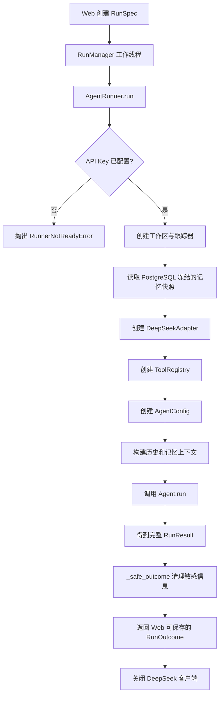

# `agent_runner.py` 通俗说明

源码位置：[`src/coding_agent/agents/runtime/agent_runner.py`](../src/coding_agent/agents/runtime/agent_runner.py)

`agent_runner.py` 是 Web 系统与核心 Agent 之间的“装配器”。

它自己不负责思考，也不实现模型循环。它负责把配置、工作区、记忆、工具和取消信号等零件组装好，然后调用真正的 `Agent.run()`。

## 一、整体流程



## 二、`RunSpec`：一次任务的输入清单

```python
@dataclass(frozen=True, slots=True)
class RunSpec:
    run_id: str
    workspace: Path
    task: str
    use_memory: bool = True
    permission_mode: PermissionMode = PermissionMode.AGENT
    prior_messages: tuple[VisibleMessage, ...] = ()
    memory_snapshot: tuple[MemoryReference, ...] = ()
```

它表示“运行一次 Agent 需要准备哪些东西”。

例如：

```python
spec = RunSpec(
    run_id="run-001",
    workspace=Path(r"E:\code\demo"),
    task="帮我修复登录接口",
    use_memory=True,
    permission_mode=PermissionMode.ASK,
    prior_messages=(
        VisibleMessage("user", "这是一个 FastAPI 项目"),
    ),
    memory_snapshot=(
        MemoryReference(
            id="memory-1",
            kind="decision",
            content="数据库统一使用 PostgreSQL",
        ),
    ),
)
```

各字段的含义如下：

- `run_id`：本次任务的唯一编号。
- `workspace`：Agent 只能操作的工作区。
- `task`：用户当前提出的任务。
- `use_memory`：是否使用项目长期记忆。
- `permission_mode`：工具执行权限。
- `prior_messages`：之前的用户可见对话。
- `memory_snapshot`：创建任务时从 PostgreSQL 冻结的记忆。

`frozen=True` 表示对象创建后不能随便修改，避免运行过程中输入发生变化。

`__post_init__()` 还会检查：

- 权限模式是否合法。
- 历史消息必须是元组。
- 记忆快照必须是元组。
- 元组中的对象类型必须正确。

## 三、`RunOutcome`：Web 可以保存的结果

```python
@dataclass(frozen=True, slots=True)
class RunOutcome:
    status: str
    reason: str
    final_content: str | None
    model_calls: int
    tool_calls: int
    usage: dict[str, int]
    duration_seconds: float
    change_check: dict[str, Any]
    memory: MemorySummary
```

它不是 Agent 最原始的结果，而是给 Web 层使用的安全摘要。

里面包括：

- 是否成功。
- 为什么停止。
- 最终回答。
- 调用了多少次模型。
- 执行了多少次工具。
- Token 使用量。
- 总耗时。
- 文件修改检查结果。
- 加载了多少条记忆。

它不会保存隐藏推理、完整工具输出等敏感内容。

## 四、`AgentRunnerProtocol`：运行器的接口合同

`AgentRunnerProtocol` 要求运行器至少提供：

```python
runner.ready
runner.model
runner.run(...)
```

可以把它理解为一份接口合同。

`RunManager` 不关心具体使用的是正式 `AgentRunner`，还是测试使用的假对象，只要符合这份合同即可。

因此测试中可以写：

```python
class FakeRunner:
    ready = True
    model = "fake-model"

    def run(self, spec, **kwargs):
        return ...
```

这样测试不需要真的请求 DeepSeek。

## 五、`CompositeTrace`：同时发送运行事件

一次事件可能需要同时发送到：

- Web 实时事件系统。
- 本地 JSONL 跟踪文件。

所以 `CompositeTrace` 会保存多个事件接收器：

```python
combined_trace = CompositeTrace(
    web_trace,
    file_trace,
)
```

当调用：

```python
combined_trace.emit("memory_loaded", loaded_count=2)
```

两个接收器都能收到事件。

如果某个跟踪器报错，代码会捕获异常并继续发送：

```python
except Exception:
    continue
```

诊断日志属于辅助能力，不能因为日志写入失败导致整个任务失败。

## 六、`AgentRunner.run()`：核心装配流程

这是整个文件最重要的函数。

### 1. 检查 API Key

```python
if not self.ready:
    raise RunnerNotReadyError(
        "DEEPSEEK_API_KEY is not configured on the server."
    )
```

如果没有配置 DeepSeek API Key，就直接拒绝启动任务。

### 2. 创建受限工作区

```python
workspace = Workspace(spec.workspace)
```

后面的文件工具和命令工具都会受到这个工作区限制，不能随意操作其他目录。

### 3. 准备跟踪日志

如果配置中开启了：

```python
self.settings.trace_enabled
```

就会创建本地跟踪文件：

```text
data_dir/
└── traces/
    └── 工作区哈希/
        └── web-run-001.jsonl
```

工作区路径会经过 SHA-256 处理，日志目录不会直接暴露完整工作区路径。

### 4. 处理记忆

```python
memory_references = spec.memory_snapshot if spec.use_memory else ()
```

如果允许使用记忆：

```text
有记忆：memory.status = "loaded"
没有记忆：memory.status = "empty"
```

如果用户关闭了记忆：

```text
memory.status = "disabled"
```

这里不会再次查询数据库，只使用创建运行时由 PostgreSQL 冻结的快照。

因此可以保证：

```text
创建任务时看到的记忆
=
Agent 实际使用的记忆
```

### 5. 创建 DeepSeek 适配器

```python
adapter = DeepSeekAdapter(
    api_key=self.settings.api_key,
    base_url=self.settings.base_url,
    model=self.settings.model,
    max_tokens=self.settings.max_tokens,
    timeout_seconds=self.settings.api_timeout_seconds,
)
```

`DeepSeekAdapter` 负责把 Agent 请求发送给 DeepSeek，并把供应商返回值转换成项目内部格式。

### 6. 创建工具注册表

```python
registry = ToolRegistry(
    workspace,
    confirm_action=confirm_command,
    cancel_check=cancel_event.is_set,
    permission_mode=spec.permission_mode,
)
```

`ToolRegistry` 负责管理文件、搜索和命令等工具。

几个重要参数：

- `workspace`：工具只能在工作区内活动。
- `confirm_action`：危险操作需要用户确认时调用。
- `cancel_check`：检查用户是否取消任务。
- `permission_mode`：决定什么操作允许自动执行。

### 7. 创建预算配置

```python
config = AgentConfig(
    max_model_calls=self.settings.max_model_calls,
    max_tool_calls=self.settings.max_tool_calls,
    max_total_tokens=self.settings.max_total_tokens,
    wall_time_seconds=self.settings.wall_time_seconds,
    api_timeout_seconds=self.settings.api_timeout_seconds,
    max_transient_retries=self.settings.max_transient_retries,
)
```

这些预算可以防止 Agent：

- 无限请求模型。
- 无限执行工具。
- 消耗过多 Token。
- 运行时间过长。
- 网络失败后无限重试。

### 8. 构建上下文

```python
context = self.context_builder.build(
    config=config,
    prior_messages=spec.prior_messages,
    memory_entries=memory_references,
)
```

上下文可能包含：

```text
之前的会话
+
项目记忆
+
当前任务
```

上下文构建器会根据字符预算进行校验和裁剪。

### 9. 创建真正的 Agent

```python
agent = Agent(
    adapter,
    registry,
    config=config,
    trace=combined_trace,
    cancel_check=cancel_event.is_set,
    run_id_factory=lambda: spec.run_id,
)
```

这里才把所有零件装到一起：

```text
DeepSeekAdapter：负责请求模型
ToolRegistry：负责执行工具
AgentConfig：负责限制预算
Trace：负责记录事件
cancel_check：负责响应取消
```

### 10. 调用 `Agent.run()`

代码根据上下文选择不同调用方式：

```python
if context.has_memory:
    result = agent.run(
        spec.task,
        system_prompt=MEMORY_AWARE_SYSTEM_PROMPT,
        context=context,
    )
elif context.prior_messages:
    result = agent.run(spec.task, context=context)
else:
    result = agent.run(spec.task)
```

三种情况分别是：

1. 有记忆：加入“记忆不可信，不能覆盖安全规则”的系统提示。
2. 只有历史消息：携带历史上下文。
3. 没有记忆和历史消息：直接运行当前任务。

`MEMORY_AWARE_SYSTEM_PROMPT` 的核心意思是：

> 项目记忆只能作为参考，不能覆盖当前任务、安全规则、审批、预算和工作区边界。

## 七、`_safe_outcome()`：过滤后再交给 Web

核心 `Agent` 返回的 `RunResult` 内容比较完整，可能包含：

- 消息历史。
- 工具执行结果。
- 模型推理相关数据。

Web 不应该把这些内容全部持久化，所以 `_safe_outcome()` 只保留必要字段：

```python
return RunOutcome(
    status=status,
    reason=reason,
    final_content=result.final_content,
    model_calls=result.model_calls,
    tool_calls=result.tool_calls,
    usage=result.usage.as_dict(),
    duration_seconds=result.duration_seconds,
    change_check=result.change_check.as_dict(),
    memory=memory,
)
```

整体过程可以理解为：

```text
完整 RunResult
    ↓ 删除不应持久化的信息
安全 RunOutcome
```

## 八、为什么使用 `finally`

```python
finally:
    close = getattr(adapter, "close", None)
    if callable(close):
        try:
            close()
        except Exception:
            pass
```

无论发生哪种情况：

- Agent 正常完成。
- 模型请求失败。
- 工具执行失败。
- 用户取消。
- 代码抛出异常。

最终都会尝试关闭 DeepSeek HTTP 客户端。

关闭客户端失败也不会覆盖原来的运行结果。

## 九、几个重要文件的职责区别

```text
run_manager.py
负责线程、任务状态、取消和审批

agent_runner.py
负责组装一次 Agent 运行

agent.py
负责模型调用和工具执行的核心循环

deepseek.py
负责请求 DeepSeek API

tools/
负责真正读文件、搜索和运行命令
```

## 十、总结

`agent_runner.py` 的核心职责是：

> 把 Web 层已经准备好的任务，安全地转换成一次核心 Agent 执行，再把完整结果过滤成 Web 可以保存的结果。

建议阅读完这个文件后，继续阅读：

1. [`agent.py`](../src/coding_agent/agents/agent.py)：了解模型和工具如何循环执行。
2. [`run_manager.py`](../src/coding_agent/agents/runtime/run_manager.py)：了解 Web 任务如何在线程池中运行。
3. [`deepseek.py`](../src/coding_agent/agents/providers/deepseek.py)：了解模型请求如何发送。
4. [`registry.py`](../src/coding_agent/agents/tools/registry.py)：了解工具调用如何分发。
