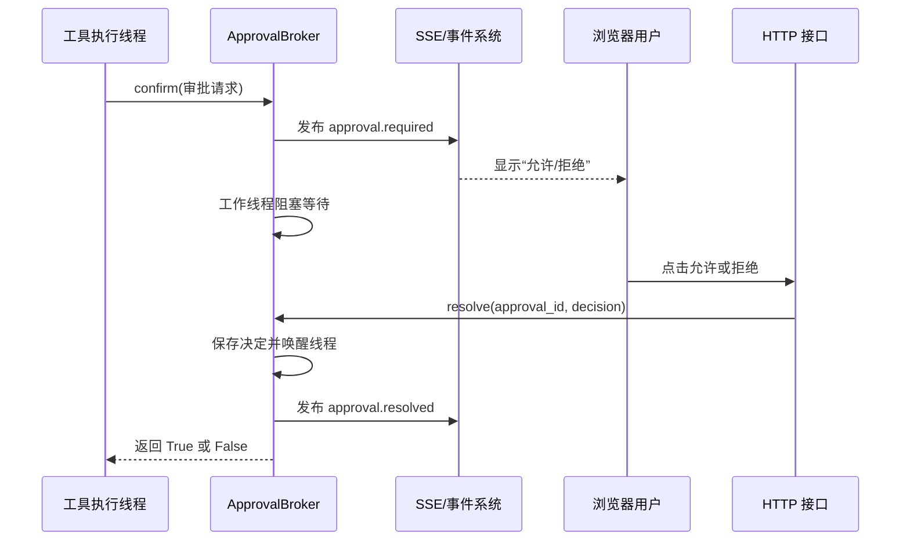

# `approval_broker.py` 通俗说明

源码位置：[`src/coding_agent/agents/runtime/approval_broker.py`](../src/coding_agent/agents/runtime/approval_broker.py)

`approval_broker.py` 可以理解为一个“审批中间人”。

它解决的问题是：

- Agent 工作线程执行危险命令时，需要同步等待用户决定。
- 用户在浏览器中异步点击“允许”或“拒绝”。
- `ApprovalBroker` 负责把这两个过程连接起来。

## 一、整体流程



## 二、`ApprovalBrokerError`

```python
class ApprovalBrokerError(RuntimeError):
    def __init__(self, code: str, message: str) -> None:
        self.code = code
        self.message = message
```

这个异常表示审批操作与当前状态冲突，例如：

- 当前没有等待审批。
- 审批 ID 已经过期。
- 审批已经处理过。
- 决定不是 `approve` 或 `reject`。
- 任务正在取消。

`code` 是程序使用的稳定错误码：

```text
approval_not_pending
approval_stale
approval_already_resolved
approval_decision_invalid
run_cancelling
```

`message` 是可以安全返回给用户的错误说明。

`RunManager` 会捕获这个异常，并把它转换成 HTTP `409 Conflict`。

## 三、`PendingApproval`

`PendingApproval` 表示当前正在等待用户处理的一条审批。

```python
@dataclass(frozen=True, slots=True)
class PendingApproval:
    approval_id: str
    tool_name: str
    action_summary: str
    argv: tuple[str, ...]
    cwd: str
    reason: str
    created_at: datetime
    expires_at: datetime
```

各字段含义如下：

- `approval_id`：审批唯一编号。
- `tool_name`：哪个工具申请审批。
- `action_summary`：给用户看的安全操作摘要。
- `argv`：命令参数。
- `cwd`：命令执行目录。
- `reason`：为什么需要审批。
- `created_at`：审批创建时间。
- `expires_at`：审批过期时间。

例如：

```python
PendingApproval(
    approval_id="23d50ab1-...",
    tool_name="run_command",
    action_summary="运行 pytest",
    argv=("python", "-m", "pytest"),
    cwd=r"E:\code\project",
    reason="该命令需要用户确认",
    created_at=...,
    expires_at=...,
)
```

### `as_dict()`

```python
pending.as_dict()
```

这个函数会把对象转换成适合 SSE、HTTP 或数据库使用的字典。

主要转换包括：

```text
argv：tuple → list
datetime → UTC ISO 字符串
```

时间结果类似：

```text
2026-09-01T08:30:00Z
```

## 四、`ApprovalBroker.__init__()`

创建代理时需要传入：

```python
broker = ApprovalBroker(
    run_id="run-001",
    cancel_event=session.cancel_event,
    timeout_seconds=120,
    run_deadline_seconds=480,
    publish=session.buffer.publish,
    pending_changed=session.set_pending,
)
```

参数含义：

- `run_id`：审批属于哪个任务。
- `cancel_event`：任务是否已经取消。
- `timeout_seconds`：一次审批最多等待多久。
- `run_deadline_seconds`：整个任务最多还能运行多久。
- `publish`：发布 SSE 运行事件的回调。
- `pending_changed`：更新当前会话待审批状态的回调。
- `clock`：提供单调时间，主要方便测试注入。

### 两种超时

假设：

```text
单次审批最多等待：120 秒
整个任务只剩：30 秒
```

真正允许等待的时间是：

```python
min(120, 30) == 30
```

审批等待不能突破整个 Agent 的运行时间预算。

## 五、为什么使用 `threading.Condition`

```python
self._condition = threading.Condition()
self._pending = None
self._decision = None
```

审批过程中存在两个线程：

```text
Agent 工作线程
调用 confirm()，等待用户决定

HTTP 请求线程
调用 resolve()，提交用户决定
```

`Condition` 可以实现：

1. 安全保护 `_pending` 和 `_decision`。
2. 让 Agent 工作线程暂停等待。
3. 用户决定后唤醒 Agent 工作线程。
4. 避免“决定已经提交，但等待线程没有收到通知”的问题。

## 六、`confirm()`：发起审批并等待

这个函数由 `ToolRegistry` 调用：

```python
approved = broker.confirm(request)
```

如果返回：

```python
True
```

工具可以继续执行。

如果返回：

```python
False
```

工具不能执行。

### 1. 计算实际等待时间

```python
effective_timeout = self.timeout_seconds
```

如果任务还有总截止时间，就取更小的值：

```python
effective_timeout = min(
    单次审批超时,
    任务剩余时间,
)
```

如果任务已经取消，或者已经没有剩余时间：

```python
return False
```

### 2. 创建审批对象

```python
pending = PendingApproval(
    approval_id=str(uuid4()),
    tool_name=request.tool_name,
    action_summary=request.action_summary,
    ...
)
```

每次审批都会生成新的 UUID，防止用户提交旧审批的决定。

### 3. 登记待审批状态

```python
with self._condition:
    self._pending = pending
    self._decision = None
```

同一个运行在同一时刻只允许存在一个待审批请求。

如果已经存在审批：

```python
if self._pending is not None:
    return False
```

因为当前工具是顺序执行的，同时出现两个审批通常意味着内部状态出现问题。

### 4. 通知 Web 层

首先更新当前运行会话：

```python
self._pending_changed(pending)
```

这样查询运行状态时就可以看到待审批信息。

接着发布事件：

```python
self._publish(
    "approval.required",
    {
        "run_id": self.run_id,
        "approval": pending.as_dict(),
    },
)
```

Web 前端通过 SSE 收到事件后，就可以显示审批窗口。

### 5. 阻塞等待

```python
while self._decision is None and not self.cancel_event.is_set():
    remaining = deadline - self._clock()
    if remaining <= 0:
        break
    self._condition.wait(timeout=min(remaining, 0.5))
```

这段代码的意思是：

```text
只要用户还没有决定
并且任务没有取消
并且还没有超时
就继续等待
```

每次最多等待 `0.5` 秒，然后重新检查任务是否取消。

调用 `wait()` 时会暂时释放条件锁，所以 HTTP 线程可以进入 `resolve()` 写入用户决定。

### 6. 判断审批结果

审批可能产生四种结果：

```text
approve    用户允许
reject     用户拒绝
expired    等待超时
cancelled  任务取消
```

只有：

```python
outcome == "approve"
```

才会返回 `True`，其他情况全部返回 `False`。

### 7. 清理状态并发布结果

```python
self._pending = None
self._decision = None
```

审批是一次性的，结束后不能再次使用。

然后通知会话当前已经没有待审批请求：

```python
self._pending_changed(None)
```

最后发布：

```text
approval.resolved
```

事件示例：

```json
{
  "run_id": "run-001",
  "approval_id": "23d50ab1-...",
  "decision": "reject",
  "resolution": "expired"
}
```

这里：

- `decision` 是工具层最终看到的允许或拒绝。
- `resolution` 是产生该结果的具体原因。

因此，超时和取消都会表现为拒绝执行，但 `resolution` 会保留真实原因。

## 七、`resolve()`：接收用户决定

当用户在浏览器中点击按钮后，HTTP 请求最终会调用：

```python
broker.resolve(
    approval_id="23d50ab1-...",
    decision="approve",
)
```

### 1. 决定是否合法

```python
if decision not in {"approve", "reject"}:
```

只允许：

```text
approve
reject
```

### 2. 是否真的有审批在等待

```python
if pending is None:
```

没有等待审批时提交决定，会得到：

```text
approval_not_pending
```

### 3. 审批 ID 是否一致

```python
if pending.approval_id != approval_id:
```

如果用户提交的是旧页面中的审批 ID，会得到：

```text
approval_stale
```

这样可以避免旧审批错误地批准新命令。

### 4. 是否已经处理过

```python
if self._decision is not None:
```

重复点击按钮会得到：

```text
approval_already_resolved
```

### 5. 任务是否正在取消

```python
if self.cancel_event.is_set():
```

任务已经取消后，就不能再批准命令。

### 6. 保存决定并唤醒工作线程

```python
self._decision = decision
self._condition.notify_all()
```

`resolve()` 本身不会执行工具。

它只负责：

```text
保存用户决定
+
唤醒 confirm() 所在的工作线程
```

真正的工具执行仍然由 `ToolRegistry` 完成。

## 八、`pending()`：查询当前审批

```python
pending = broker.pending()
```

它会返回：

```python
PendingApproval
```

或者：

```python
None
```

读取过程受到同一个条件锁保护，避免刚好与 `confirm()` 或 `resolve()` 同时修改状态。

## 九、`cancel()`：唤醒等待线程

```python
def cancel(self) -> None:
    with self._condition:
        self._condition.notify_all()
```

需要注意：这个函数本身不会设置取消状态。

正确顺序是由 `RunSession.request_cancel()` 执行：

```python
self.cancel_event.set()
broker.cancel()
```

完整过程是：

1. 设置 `cancel_event`。
2. 唤醒正在等待审批的线程。
3. `confirm()` 醒来后发现任务已经取消。
4. `confirm()` 返回 `False`。

如果只调用 `broker.cancel()`，但没有设置 `cancel_event`，等待线程醒来后仍然可能继续等待。

## 十、完整示例

假设 Agent 想执行：

```text
python -m pytest
```

整个过程是：

```text
1. ToolRegistry 发现该命令需要审批
2. 调用 broker.confirm(request)
3. Broker 创建 approval_id
4. 发布 approval.required
5. Agent 工作线程暂停
6. 浏览器显示“允许/拒绝”
7. 用户点击“允许”
8. HTTP 调用 broker.resolve(id, "approve")
9. resolve() 保存决定并唤醒线程
10. confirm() 返回 True
11. ToolRegistry 执行 python -m pytest
```

如果用户一直不操作：

```text
等待超过有效时间
→ confirm() 返回 False
→ 命令不会执行
→ 发布 resolution="expired"
```

## 十一、与其他文件的关系

```text
ToolRegistry
判断某个工具操作是否需要用户确认
        ↓
ApprovalBroker.confirm()
发布审批并阻塞等待
        ↓
RunManager / HTTP 接口
接收浏览器提交的决定
        ↓
ApprovalBroker.resolve()
保存决定并唤醒工作线程
        ↓
ToolRegistry
根据 True 或 False 决定是否执行工具
```

建议结合以下文件阅读：

1. [`run_manager.py`](../src/coding_agent/agents/runtime/run_manager.py)：了解 Broker 如何创建、取消和接收 HTTP 决定。
2. [`agent_runner.py`](../src/coding_agent/agents/runtime/agent_runner.py)：了解 `broker.confirm` 如何注入工具注册表。
3. [`registry.py`](../src/coding_agent/agents/tools/registry.py)：了解工具如何申请审批并执行。
4. [`run_service.py`](../src/coding_agent/services/run_service.py)：了解审批事件如何持久化到 PostgreSQL。

## 十二、总结

`ApprovalBroker` 的核心职责是：

> 安全地让 Agent 工作线程暂停，等待 Web 用户提交审批结果，再把结果交回工具执行流程。

它不负责判断命令是否危险，也不负责执行命令。它只负责审批请求、用户决定、工作线程之间的同步桥接。
