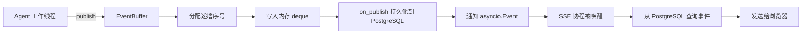

# `event_buffer.py` 通俗说明

源码位置：[`src/coding_agent/agents/runtime/event_buffer.py`](../src/coding_agent/agents/runtime/event_buffer.py)

`event_buffer.py` 可以理解成运行事件的“内存通知站”。

Agent 在后台线程中不断产生事件，例如：

```text
任务已接受
任务已启动
模型调用完成
工具开始执行
等待用户审批
任务已完成
```

`EventBuffer` 负责：

1. 给事件分配连续序号。
2. 在内存中保留最近一部分事件。
3. 调用持久化回调，把事件保存到 PostgreSQL。
4. 唤醒正在等待新事件的 SSE 异步连接。

## 一、整体流程



这里有一个重要设计：

> PostgreSQL 是事件重放的数据来源，`EventBuffer` 主要负责实时通知，减少 SSE 轮询延迟。

浏览器断线重连后，不依赖内存缓冲区，而是从数据库继续读取。

## 二、`utc_now()`

```python
def utc_now() -> datetime:
    return datetime.now(timezone.utc)
```

这个函数返回带 UTC 时区的当前时间。

例如：

```text
2026-09-01T09:30:00Z
```

统一使用 UTC 可以避免服务器时区不同导致事件时间错乱。

## 三、`RunEvent`：一条运行事件

```python
@dataclass(frozen=True, slots=True)
class RunEvent:
    seq: int
    event: str
    timestamp: datetime
    data: dict[str, Any]
```

各字段含义如下：

- `seq`：严格递增的事件序号。
- `event`：事件名称。
- `timestamp`：事件创建时间。
- `data`：事件携带的公开数据。

例如：

```python
RunEvent(
    seq=3,
    event="tool.started",
    timestamp=...,
    data={
        "run_id": "run-001",
        "tool_name": "read_file",
    },
)
```

### 为什么需要 `seq`

浏览器可能依次收到：

```text
事件 1：run.accepted
事件 2：run.started
事件 3：tool.started
事件 4：tool.completed
```

如果浏览器收到事件 3 后断线，重连时可以告诉服务器：

```text
我最后收到的是 seq=3
```

服务器就可以从事件 4 开始发送，避免重复或遗漏。

### `as_dict()`

```python
event.as_dict()
```

会转换成：

```json
{
  "seq": 3,
  "event": "tool.started",
  "timestamp": "2026-09-01T09:30:00Z",
  "data": {
    "run_id": "run-001",
    "tool_name": "read_file"
  }
}
```

## 四、`EventSubscription`：异步事件订阅

Agent 在普通工作线程中运行，而 SSE 接口运行在 `asyncio` 事件循环中。

两边不能直接使用同一种等待方式：

```text
Agent：普通线程
SSE：异步协程
```

`EventSubscription` 就是两者之间的通知桥梁。

它保存：

```python
self._owner
self._token
self._signal
self._closed
```

- `_owner`：所属的 `EventBuffer`。
- `_token`：订阅唯一编号。
- `_signal`：用于唤醒异步协程的 `asyncio.Event`。
- `_closed`：订阅是否已经关闭。

### `wait()`

```python
received = await subscription.wait(15.0)
```

最多等待 15 秒。

返回：

```python
True   # 收到新事件通知
False  # 等待超时
```

它使用：

```python
await asyncio.wait_for(
    self._signal.wait(),
    timeout=timeout_seconds,
)
```

因此不会阻塞整个 FastAPI 事件循环。

### `clear()`

```python
subscription.clear()
```

这个函数清除上一次通知标记，为等待下一次事件做准备。

SSE 代码中的顺序是：

```python
subscription.clear()
查询数据库事件
等待下一次通知
```

先清除再查询很重要。假如查询数据库期间发布了新事件，通知标记会重新变成已设置，后面的 `wait()` 会立即返回，不会漏掉唤醒。

### `close()`

```python
subscription.close()
```

它会关闭订阅，并从 `EventBuffer` 中移除该订阅者。

这个操作是幂等的，多次调用也只会真正取消一次订阅。

浏览器断开连接或者任务结束时，SSE 接口会在 `finally` 中调用它。

## 五、`EventBuffer.__init__()`

```python
buffer = EventBuffer(
    max_events=256,
    on_publish=persist_event,
)
```

参数含义：

- `max_events`：内存中最多保存多少条最新事件。
- `on_publish`：发布事件时调用的持久化回调。

主要内部属性：

```python
self._events = deque(maxlen=max_events)
self._next_sequence = 1
self._subscribers = {}
self._lock = threading.Lock()
self._callback_errors = 0
```

### 为什么使用 `deque(maxlen=...)`

它是一个自动限制容量的双端队列。

假设：

```python
buffer = EventBuffer(max_events=3)
```

连续发布：

```text
事件 1
事件 2
事件 3
事件 4
```

内存最终只保留：

```text
事件 2
事件 3
事件 4
```

最旧的事件 1 会被自动淘汰。

但是序号不会重新开始，下一条仍然是事件 5。这可以防止长时间运行产生无限内存占用。

## 六、`publish()`：发布事件

这是文件中最重要的函数。

调用示例：

```python
event = buffer.publish(
    "run.started",
    {
        "run_id": "run-001",
        "status": "running",
    },
)
```

### 1. 检查事件名称

```python
if not isinstance(event, str) or not event:
    raise ValueError(...)
```

事件名称必须是非空字符串。

### 2. 对数据进行 JSON 往返

```python
safe_data = json.loads(
    json.dumps(
        dict(data or {}),
        ensure_ascii=False,
        allow_nan=False,
        separators=(",", ":"),
    )
)
```

可以理解成：

```text
Python 数据
→ 转成 JSON
→ 再转回新的 Python 数据
```

这样做有三个目的。

#### 确保数据可以安全序列化

下面的数据会被拒绝：

```python
{"path": Path("README.md")}
{"value": object()}
{"callback": lambda: None}
```

因为它们不能直接转换成 JSON。

#### 拒绝 NaN 和无穷大

```python
{"value": float("nan")}
{"value": float("inf")}
```

由于设置了：

```python
allow_nan=False
```

这些值会抛出异常，避免产生不符合标准的 JSON。

#### 创建防御性副本

假设调用方发布后修改原始字典：

```python
data = {"status": "running"}
event = buffer.publish("run.started", data)

data["status"] = "failed"
```

已经进入事件缓冲区的数据不会跟着被修改。

### 3. 分配事件序号

```python
item = RunEvent(
    self._next_sequence,
    event,
    utc_now(),
    safe_data,
)
self._next_sequence += 1
```

序号从 1 开始，严格递增。

分配序号受到线程锁保护，因此多个工作线程同时发布事件，也不会得到重复序号。

### 4. 写入内存缓冲区

```python
self._events.append(item)
```

超过 `max_events` 后，最旧的事件会自动淘汰。

### 5. 执行持久化回调

```python
self._on_publish(item)
```

在这个项目中，回调通常负责把事件写入 PostgreSQL。

序号分配、内存追加和持久化回调位于同一个锁范围内，这样可以保证：

```text
内存中的事件顺序
=
数据库中的事件顺序
=
SSE 实时发送顺序
```

这个回调不能反过来调用同一个 `EventBuffer`，否则可能因为重复获取普通线程锁而死锁。

### 持久化失败怎么办

```python
except Exception:
    self._callback_errors += 1
```

持久化回调失败不会让 Agent 任务直接失败，也不会阻止内存通知。

失败次数会被记录，后续服务层可以进行修复或对账。

### 6. 复制订阅者列表

```python
subscribers = tuple(self._subscribers.values())
```

复制完成后就释放线程锁。

后面的通知操作在锁外执行，避免某个异步事件循环影响其他发布操作。

### 7. 跨线程通知 SSE

```python
loop.call_soon_threadsafe(signal.set)
```

不能直接从 Agent 工作线程调用：

```python
signal.set()
```

因为 `asyncio.Event` 属于特定事件循环。

`call_soon_threadsafe()` 的意思是：

> 请对应的 asyncio 事件循环在自己的线程中安全执行 `signal.set()`。

SSE 协程随后就会从 `wait()` 中醒来。

如果浏览器已经断开，事件循环正在关闭：

```python
except RuntimeError:
    continue
```

这不会影响 Agent 继续运行。

## 七、`read_after()`：读取指定序号之后的事件

调用示例：

```python
events, gap = buffer.read_after(3)
```

表示读取：

```text
seq > 3 的所有内存事件
```

返回两个值：

```python
events  # 后续事件
gap     # 是否存在被内存淘汰的事件
```

### 正常情况

当前缓冲区包含：

```text
seq=3
seq=4
seq=5
```

调用：

```python
buffer.read_after(3)
```

返回：

```text
events = [4, 5]
gap = False
```

### 存在缺口

假设缓冲区容量是 2，先后发布事件：

```text
1、2、3
```

内存只剩：

```text
2、3
```

现在调用：

```python
buffer.read_after(0)
```

调用方想从事件 1 开始读取，但事件 1 已经被淘汰，因此：

```text
events = [2, 3]
gap = True
```

这时不能只相信内存缓冲区，需要从 PostgreSQL 重放缺失事件。

缺口判断代码是：

```python
gap = sequence < events[0].seq - 1
```

## 八、`latest_sequence`

```python
buffer.latest_sequence
```

这个属性返回最近发布的事件序号。

还没有发布事件时：

```text
0
```

已经发布 5 条事件时：

```text
5
```

它通过下一个待分配序号计算：

```python
self._next_sequence - 1
```

## 九、持久化错误计数

### `callback_errors`

```python
buffer.callback_errors
```

这个属性返回持久化回调累计失败了多少次。

例如：

```text
3
```

表示有三次事件持久化回调抛出了异常。

### `acknowledge_callback_errors()`

```python
count = buffer.acknowledge_callback_errors()
```

它会：

1. 返回清零前的失败次数。
2. 把失败计数重置为 0。

例如：

```python
count == 3
buffer.callback_errors == 0
```

服务层完成数据库修复或对账后会调用它。

## 十、`subscribe()`：创建实时订阅

```python
subscription = buffer.subscribe()
```

这个函数必须在正在运行的 `asyncio` 事件循环中调用，因为内部使用：

```python
asyncio.get_running_loop()
```

它会：

1. 取得当前 SSE 所在的事件循环。
2. 创建一个 `asyncio.Event`。
3. 为订阅分配内部 `token`。
4. 把事件循环和信号保存到订阅者字典。
5. 返回 `EventSubscription`。

一个运行可以有多个 SSE 客户端，每个客户端都有自己的：

```text
事件循环
asyncio.Event
订阅 token
```

发布新事件时，所有订阅者都会被唤醒。

## 十一、`_unsubscribe()`：取消订阅

```python
self._subscribers.pop(token, None)
```

订阅关闭后，就会从注册表中移除。

使用 `pop(token, None)` 的好处是：即使已经移除，再次关闭也不会报错。

## 十二、在 SSE 接口中的实际用法

[`router/runs.py`](../src/coding_agent/router/runs.py) 中的主要逻辑是：

```python
subscription = buffer.subscribe()

while True:
    subscription.clear()

    events = 从 PostgreSQL 查询新事件

    if events:
        发送给浏览器
        continue

    if not await subscription.wait(15.0):
        发送 keep-alive
```

完整流程是：

```text
先查 PostgreSQL
    ↓
有事件 → 发给浏览器
    ↓
没有事件 → 等待 EventBuffer 通知
    ↓
Agent 发布事件 → SSE 被立即唤醒
    ↓
再次查询 PostgreSQL
```

### 为什么被唤醒后还要查询 PostgreSQL

原因包括：

- PostgreSQL 是可靠、可恢复的事件来源。
- `EventBuffer` 通知只代表“可能有新事件”。
- 内存事件会因容量限制被淘汰。
- 服务重启后内存事件会消失。
- 数据库可以支持浏览器断线续传。

如果等待 15 秒仍然没有事件，SSE 接口会发送：

```text
: keep-alive
```

防止代理或浏览器因为长时间没有数据而关闭连接。

## 十三、它不负责什么

`EventBuffer` 不负责：

- 执行 Agent。
- 格式化最终 SSE 文本帧。
- 永久保存全部事件。
- 判断任务是否结束。
- 处理用户审批。
- 代替 PostgreSQL 进行事件重放。

它只负责：

```text
短期保留最近事件
+
为事件分配顺序号
+
调用持久化回调
+
跨线程唤醒异步 SSE 消费者
```

## 十四、与其他文件的关系

建议结合以下文件阅读：

1. [`run_manager.py`](../src/coding_agent/agents/runtime/run_manager.py)：了解每次运行如何创建 `EventBuffer`。
2. [`runs.py`](../src/coding_agent/router/runs.py)：了解 SSE 如何订阅并等待通知。
3. [`run_service.py`](../src/coding_agent/services/run_service.py)：了解事件如何持久化到 PostgreSQL。
4. [`approval_broker.py`](../src/coding_agent/agents/runtime/approval_broker.py)：了解审批事件如何发布到缓冲区。

## 十五、总结

`EventBuffer` 的核心职责是：

> 连接 Agent 普通工作线程和 FastAPI 异步 SSE，给事件分配稳定顺序，并在新事件出现时立即唤醒浏览器连接。

PostgreSQL 负责事件的可靠保存和重放，`EventBuffer` 负责实时通知和短期内存缓存。
