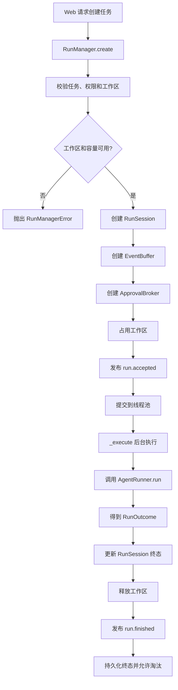
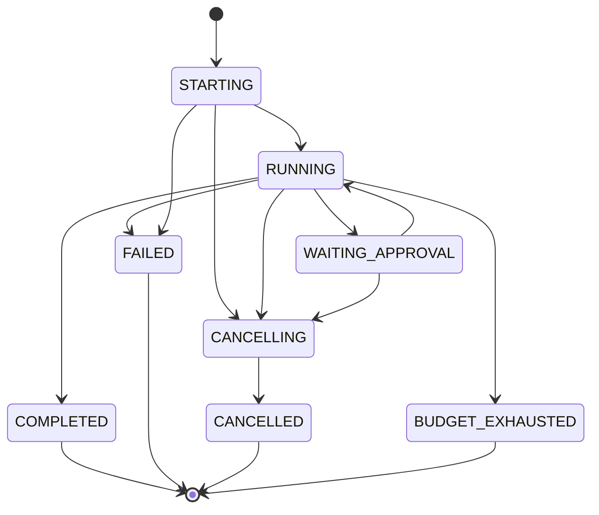

# `run_manager.py` 通俗说明

源码位置：[`src/coding_agent/agents/runtime/run_manager.py`](../src/coding_agent/agents/runtime/run_manager.py)

`run_manager.py` 可以理解成 Web Agent 的“运行调度中心”。

它不负责模型思考，也不直接执行工具。它负责管理：

- 任务什么时候创建。
- 任务在哪个线程执行。
- 同一工作区是否已经有任务。
- 当前任务是什么状态。
- 用户取消任务。
- 工具等待审批。
- 运行事件发布。
- 任务结束后的资源释放和持久化对账。

## 一、整体运行流程



## 二、任务状态 `RunStatus`

```python
class RunStatus(str, Enum):
    STARTING = "starting"
    RUNNING = "running"
    WAITING_APPROVAL = "waiting_approval"
    CANCELLING = "cancelling"
    COMPLETED = "completed"
    FAILED = "failed"
    CANCELLED = "cancelled"
    BUDGET_EXHAUSTED = "budget_exhausted"
```

状态变化大致如下：



四种终态保存在：

```python
TERMINAL_STATUSES = frozenset({
    RunStatus.COMPLETED,
    RunStatus.FAILED,
    RunStatus.CANCELLED,
    RunStatus.BUDGET_EXHAUSTED,
})
```

进入终态后，任务不能继续运行或再次取消。

## 三、`RunManagerError`

```python
class RunManagerError(RuntimeError):
    code: str
    message: str
    status_code: int
```

它是可以直接映射到 HTTP 响应的安全错误。

例如：

```python
RunManagerError(
    code="workspace_busy",
    message="This workspace already has an active run.",
    status_code=409,
)
```

常见错误：

| 错误码 | 含义 |
| --- | --- |
| `task_invalid` | 任务为空 |
| `workspace_busy` | 工作区已有运行 |
| `run_capacity_reached` | 活动任务达到上限 |
| `provider_not_configured` | 没有配置 DeepSeek |
| `run_not_found` | 找不到运行 |
| `service_shutting_down` | 服务正在关闭 |
| `memory_mutation_in_progress` | 工作区记忆正在修改 |

错误信息经过控制，不会把密钥、任务内容或供应商响应暴露给客户端。

## 四、两个辅助函数

### `_utc_text()`

把 UTC 时间转换成适合 API 返回的字符串。

例如：

```text
2026-09-01T10:30:00+00:00
```

转换为：

```text
2026-09-01T10:30:00Z
```

如果输入是 `None`，仍然返回 `None`。

### `_empty_usage()`

给每个任务创建独立的 Token 用量字典：

```python
{
    "prompt_tokens": 0,
    "completion_tokens": 0,
    "total_tokens": 0,
    "prompt_cache_hit_tokens": 0,
    "prompt_cache_miss_tokens": 0,
}
```

使用函数创建可以避免多个任务错误地共享同一个字典。

## 五、`BufferTrace`：把内部诊断转换成 Web 事件

核心 Agent 产生的事件名称是：

```text
memory_loaded
model_completed
tool_started
tool_completed
```

Web 对外事件名称是：

```text
memory.loaded
model.completed
tool.started
tool.completed
```

对应关系保存在：

```python
_EVENT_MAP = {
    "memory_loaded": "memory.loaded",
    "model_completed": "model.completed",
    "tool_started": "tool.started",
    "tool_completed": "tool.completed",
}
```

`BufferTrace.emit()` 只接受映射表中的事件，未知事件直接忽略。

这是一个安全白名单，防止内部未审核信息被意外发送到浏览器。

### 记忆事件的特殊处理

`memory_loaded` 中的字段会被重新校验：

- `status` 必须是允许的状态。
- `loaded_ids` 只保留字符串。
- `loaded_count` 必须是非负整数。
- 非法数据退化为安全默认值。

处理后还会调用：

```python
session.set_memory(summary)
```

同步更新运行会话中的记忆状态。

### 工具名称转换

内部字段：

```python
{"tool": "read_file"}
```

会转换为 Web 契约：

```python
{"tool_name": "read_file"}
```

最后发布到 `EventBuffer`：

```python
self.buffer.publish(public_name, payload)
```

## 六、`RunSession`：一个任务的进程内状态

`RunSession` 可以理解成一张不断更新的“任务状态表”。

它保存：

- 运行 ID。
- 工作区。
- 权限模式。
- 当前状态。
- 开始和结束时间。
- 最终回答。
- Token 用量。
- 模型和工具调用次数。
- 记忆加载状态。
- 当前待审批请求。
- 取消信号。
- 后台线程 `Future`。
- 事件缓冲区。
- 最终持久化状态。

它使用：

```python
lock: threading.RLock
```

保护所有可变字段。

### 为什么使用 `RLock`

同一个线程在某些调用链中可能重复进入会话锁。

`RLock` 允许同一线程重复获取锁，普通 `Lock` 在这种情况下可能把自己锁死。

## 七、`RunSession.summary()`

```python
summary = session.summary()
```

这个函数在锁内生成一致的运行快照。

返回内容类似：

```python
{
    "run_id": "run-001",
    "status": "running",
    "workspace": r"E:\code\project",
    "permission_mode": "ask",
    "created_at": "...Z",
    "started_at": "...Z",
    "finished_at": None,
    "final_content": None,
    "model_calls": 1,
    "tool_calls": 2,
    "memory": {...},
    "pending_approval": None,
    "cancel_requested": False,
}
```

它会复制内部字典，避免调用方修改会话状态。

## 八、`RunSession` 的状态更新函数

### `mark_running()`

```python
if not session.mark_running():
```

如果任务没有被提前取消：

```text
STARTING → RUNNING
```

并设置 `started_at`。

如果任务在线程真正启动前就被取消，则返回 `False`。

### `set_pending()`

有审批请求：

```text
RUNNING → WAITING_APPROVAL
```

审批结束：

```text
WAITING_APPROVAL → RUNNING
```

如果已经进入终态或者正在取消，就不再修改状态。

### `set_memory()`

更新任务实际加载的记忆摘要。

如果用户明确关闭记忆：

```python
memory.status == "disabled"
```

后续事件不能把它覆盖成 `loaded`。

### `request_cancel()`

执行：

```python
self.cancel_event.set()
self.status = RunStatus.CANCELLING
broker.cancel()
```

它不会强制杀死线程，而是采用协作式取消：

```text
设置取消信号
→ 唤醒审批等待
→ Agent 和命令工具定期检查
→ 安全停止
```

如果任务已经进入终态，就返回 `False`。

### `finish()`

把 `AgentRunner` 返回的 `RunOutcome` 合并到会话。

映射关系如下：

| `RunOutcome.status` | `RunStatus` |
| --- | --- |
| `model_finished` | `COMPLETED` |
| `budget_exhausted` | `BUDGET_EXHAUSTED` |
| `cancelled` | `CANCELLED` |
| 其他 | `FAILED` |

如果取消信号已经设置，即使运行器同时返回了其他结果，也优先记为：

```text
CANCELLED
```

这样可以避免用户已经取消，最终状态却显示为完成。

### `fail()`

当运行器没有正常返回 `RunOutcome` 时使用。

例如：

- 模型没有配置。
- 工作区异常。
- 配置错误。
- 未预期内部异常。

如果用户已经取消，取消语义仍然优先；否则记录安全错误：

```python
{
    "code": "internal_run_error",
    "message": "The run failed unexpectedly.",
}
```

## 九、SSE 结束和会话淘汰的区别

这里有两个不同概念。

### `stream_complete`

```text
运行进入终态
+
run.finished 已经发布
```

满足后，SSE 可以安全结束。

### `evictable`

```text
运行进入终态
+
run.finished 已经发布
+
PostgreSQL 终态对账完成
```

三个条件全部满足后，才能从进程内缓存淘汰。

这样可以防止任务刚结束、数据库还没保存完成，会话就被清除。

## 十、`RunManager.__init__()`

主要配置示例：

```python
RunManager(
    runner=agent_runner,
    workspace_policy=workspace_policy,
    max_active_runs=1,
    max_retained_runs=50,
    event_buffer_size=256,
    approval_timeout_seconds=480,
)
```

内部重要结构：

```python
_sessions
_active_workspaces
_memory_mutations
_executor
_lock
_closing
```

### `_sessions`

```python
OrderedDict[str, RunSession]
```

保存当前进程中的活动任务和最近结束的任务。

使用 `OrderedDict` 是为了按创建顺序淘汰最旧任务。

### `_active_workspaces`

```python
{
    "规范化工作区路径": "run_id"
}
```

它保证同一工作区同一时间最多执行一个 Agent。

例如：

```text
E:\code\project → run-001
```

再次对该目录创建任务会收到：

```text
workspace_busy
```

### `_memory_mutations`

记录正在修改项目记忆的工作区。

它用于保证：

```text
同一工作区执行 Agent
与
修改该工作区记忆
```

不能同时发生。

### `_executor`

```python
ThreadPoolExecutor(
    max_workers=max_active_runs,
)
```

真正的 Agent 是同步代码，所以放在线程池中运行，避免阻塞 FastAPI 异步事件循环。

## 十一、`create()`：创建运行

这是 `RunManager` 最重要的函数。

### 1. 校验输入

检查：

- 任务必须是非空字符串。
- 任务不能超过 100000 字符。
- 权限模式必须合法。
- 历史消息必须是元组。
- 记忆快照必须是元组。
- 运行 ID 必须合法。
- 工作区必须通过白名单校验。

### 2. 原子检查运行条件

在管理器锁中检查：

```text
服务是否关闭
记忆是否正在修改
DeepSeek 是否配置
工作区是否已经被占用
活动运行是否达到上限
会话缓存是否有空间
运行 ID 是否重复
```

这些检查必须在同一个锁中完成。

否则两个 HTTP 请求可能同时检查到“工作区空闲”，然后同时启动两个任务。

### 3. 组装会话

创建：

```text
RunSession
EventBuffer
ApprovalBroker
```

并建立关系：

```text
RunSession
├── EventBuffer
├── ApprovalBroker
├── cancel_event
└── Future
```

### 4. 占用工作区

```python
self._sessions[run_id] = session
self._active_workspaces[workspace_key] = run_id
```

从这里开始，其他请求不能再对同一工作区启动任务。

### 5. 发布接受事件

```python
session.buffer.publish(
    "run.accepted",
    {
        "run_id": run_id,
        "status": "starting",
    },
)
```

这个事件表示任务已经登记，但后台线程可能还没有真正开始执行。

### 6. 提交线程池

```python
future = self._executor.submit(
    self._execute,
    ...
)
```

`create()` 不等待 Agent 完成，而是立即返回：

```python
session.summary()
```

因此 Web 请求可以快速得到：

```text
status = starting
```

后续进度通过 SSE 获取。

如果线程池提交失败，会：

1. 释放工作区。
2. 把任务标记为失败。
3. 返回 `run_start_failed`。

## 十二、查询、取消和审批

### `get()`

返回某次运行的当前摘要。

### `get_buffer()`

返回该运行的实时 `EventBuffer`，供 SSE 使用。

### `is_terminal()`

判断任务是否进入终态。

### `is_stream_complete()`

判断最终 SSE 事件是否已经发布。

### `cancel()`

```python
manager.cancel(run_id)
```

设置协作式取消信号，然后返回最新摘要。

### `resolve_approval()`

```python
manager.resolve_approval(
    run_id,
    approval_id,
    "approve",
)
```

把 HTTP 用户决定交给对应的 `ApprovalBroker`，唤醒正在等待审批的工具线程。

## 十三、`reserve_memory_mutation()`

使用方式：

```python
with manager.reserve_memory_mutation(workspace):
    修改 PostgreSQL 中的工作区记忆
```

进入时检查：

- 服务没有关闭。
- 工作区没有活动 Agent。
- 没有其他线程正在修改该工作区记忆。

然后登记：

```python
self._memory_mutations.add(key)
```

无论数据库操作成功还是失败，`finally` 都会释放：

```python
self._memory_mutations.discard(key)
```

这样可以防止记忆修改占位永久残留。

## 十四、`validate_memory_source()`

如果用户想把某次运行结果保存成记忆，这个函数会检查：

1. 来源运行存在。
2. 来源运行和记忆属于同一个工作区。
3. 来源运行必须是 `COMPLETED`。

失败、取消或预算耗尽的任务不能直接作为确认记忆来源。

## 十五、`list()`

```python
manager.list(limit=20)
```

返回最近的运行，新任务排在前面。

数量会被限制在：

```text
1～100
```

避免一次返回过多进程内状态。

## 十六、`shutdown()`

关闭服务时：

1. 设置 `_closing=True`。
2. 停止接受新任务。
3. 给所有活动任务发送取消信号。
4. 关闭线程池。
5. 取消还没有开始的 `Future`。

多次调用 `shutdown()` 也只会执行一次。

## 十七、`_execute()`：后台线程真正执行任务

执行步骤如下。

### 1. 切换为运行状态

```python
session.mark_running()
```

如果在线程启动前已经取消，就直接进入取消结果。

### 2. 发布启动事件

```python
session.buffer.publish("run.started", ...)
```

### 3. 调用 `AgentRunner`

```python
outcome = self.runner.run(
    RunSpec(...),
    cancel_event=session.cancel_event,
    confirm_command=broker.confirm,
    trace=BufferTrace(...),
)
```

这里把三条重要通道交给 `AgentRunner`：

- `cancel_event`：让 Agent 和工具响应取消。
- `broker.confirm`：让危险工具等待 Web 审批。
- `BufferTrace`：把 Agent 内部事件发送到 SSE。

### 4. 合并运行结果

```python
session.finish(outcome)
```

把运行器结果转换为 Web 运行状态。

### 5. 处理异常

错误会被转换成安全结果：

```text
RunnerNotReadyError → provider_not_configured
WorkspaceError      → 工作区错误
ValueError          → run_configuration_error
其他异常            → internal_run_error
```

最后一种情况不会返回原始异常文本，避免泄漏任务、凭据或供应商数据。

### 6. 无条件收尾

`finally` 中一定会：

1. 释放工作区占位。
2. 发布 `run.finished`。
3. 执行终态持久化回调。

这里先释放工作区，再发布最终事件。浏览器看到 `run.finished` 时，就可以确定该工作区允许后续运行或记忆修改。

## 十八、`run.finished` 事件

最终事件包括：

```python
{
    "run_id": ...,
    "status": ...,
    "reason": ...,
    "model_calls": ...,
    "tool_calls": ...,
    "usage": ...,
    "duration_seconds": ...,
    "change_check": ...,
}
```

发布后调用：

```python
session.mark_final_event_published()
```

此时 SSE 才能安全结束。

最终回答 `final_content` 没有放进公共事件中，而是通过受控的运行结果接口获取。

## 十九、终态会话淘汰

`_evict_terminal_locked()` 会从最旧会话开始，寻找满足以下条件的运行：

```text
已经终止
+
最终事件已发布
+
PostgreSQL 对账已完成
```

找到后才能从 `_sessions` 删除。

如果缓存已经满了，但所有终态任务都还没有完成持久化对账，新任务会收到：

```text
run_retention_unavailable
```

系统不会为了腾出内存空间而丢弃尚未可靠保存的运行。

## 二十、线程安全结构

这个文件中存在多层锁，各自负责不同范围：

| 组件 | 同步工具 | 保护内容 |
| --- | --- | --- |
| `RunManager` | `threading.RLock` | 会话索引、工作区占用、关闭状态 |
| `RunSession` | `threading.RLock` | 单个任务的状态和统计信息 |
| `EventBuffer` | `threading.Lock` | 事件序号、缓存和订阅者 |
| `ApprovalBroker` | `threading.Condition` | 待审批请求和用户决定 |

这样可以避免使用一把全局大锁保护所有操作，减少不同任务之间不必要的等待。

## 二十一、与其他文件的关系

```text
router/runs.py
接收 HTTP 创建、取消、审批和 SSE 请求
        ↓
services/run_service.py
处理 PostgreSQL 事务和运行记录
        ↓
run_manager.py
管理进程内线程、状态、占位和生命周期
        ↓
agent_runner.py
装配一次 Agent 运行
        ↓
agent.py
执行模型与工具循环
```

相关组件：

```text
event_buffer.py
负责事件缓存和 SSE 唤醒

approval_broker.py
负责同步工具线程与 HTTP 审批之间的桥接

agent_runner.py
负责创建 DeepSeek、工具注册表和 AgentConfig
```

建议结合以下文档阅读：

1. [`agent_runner.md`](agent_runner.md)：了解一次 Agent 运行如何装配。
2. [`approval_broker.md`](approval_broker.md)：了解审批等待和用户决定如何桥接。
3. [`event_buffer.md`](event_buffer.md)：了解运行事件如何通知 SSE。

## 二十二、总结

`RunManager` 的核心职责是：

> 让每个 Web Agent 任务在正确的工作区、线程、权限、审批和生命周期约束下安全执行，并保证任何成功、失败或取消路径都能完整收尾。

它是 Web Agent 的运行时总管，而真正的模型与工具循环由 `AgentRunner` 和 `Agent` 完成。
